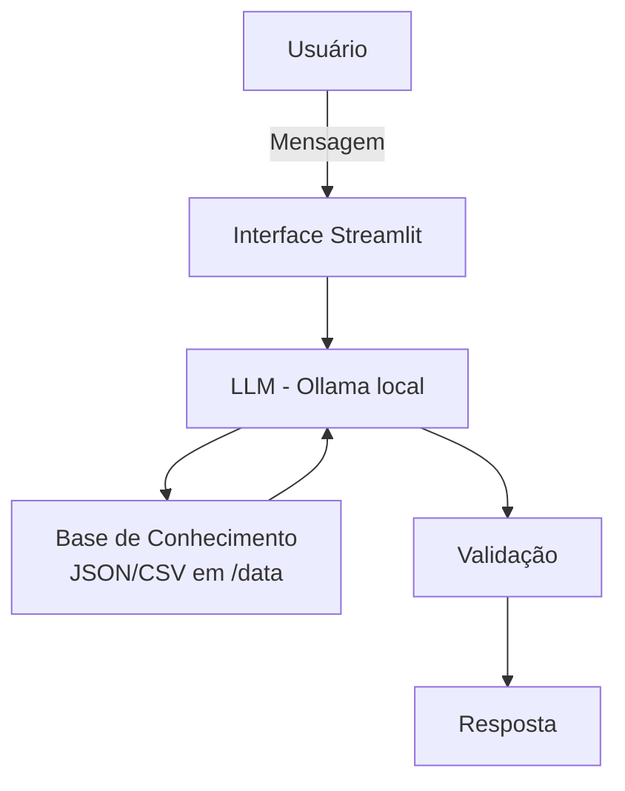

# 🤖 Nexus — Agente Inteligente de Análise de Feedbacks

> Agente de IA Generativa que transforma feedbacks de clientes sobre ligações ativas de gerentes de agência em **insights claros, priorizados e acionáveis**.

Projeto desenvolvido no desafio **BIA do Futuro** da [DIO](https://www.dio.me/) (Bootcamp de IA Generativa).

---

## 📌 Sobre o Projeto

### O problema

Analisar feedbacks de clientes sobre ofertas de produtos financeiros feitas por telefone é difícil. Além do grande volume de dados, há vieses emocionais de quem analisa, respostas vagas ("Não gostei") e comentários subjetivos ou sarcásticos que as métricas quantitativas (notas de 1 a 10) não capturam.

### A solução

O **Nexos** atua como um consultor automatizado: processa grandes volumes de feedbacks (e-mails, redes sociais e pesquisas) e converte textos não estruturados em métricas e insights, conectando a voz do cliente às melhorias nos produtos e processos.

### O que o agente faz

| Capacidade | Descrição |
| --- | --- |
| **Leitura contextual** | Interpreta comentários vagos, sarcásticos ou subjetivos em textos abertos |
| **Feedback sem contexto** | Identifica críticas genéricas e aponta a possível etapa do processo ou lacuna de informação |
| **Público silencioso** | Detecta e relata a percepção da maioria moderada que não responde a pesquisas |
| **Nuances culturais e de intensidade** | Calibra o peso de termos como "razoável" ou "ruim" conforme diferenças regionais e culturais |
| **Diagnóstico de pesquisas** | Identifica perguntas ambíguas ou mal desenhadas que geram respostas confusas |
| **Priorização** | Classifica a gravidade dos problemas e indica a equipe responsável |

### Público-alvo

- Customer Experience (CX) e Sucesso do Cliente (CS)
- Ouvidoria (Ombudsman)
- Equipes de Produto e Tecnologia
- Atendimento e Operações (SAC e Suporte)

---

## 🎭 Persona

- **Nome:** Nexos (conecta os dados de feedback às melhorias nos produtos)
- **Personalidade:** imparcial e orientado a dados, sem vieses emocionais
- **Tom de voz:** construtivo, formal e técnico

---

## 🏗️ Arquitetura



| Componente | Tecnologia |
| --- | --- |
| Interface | [Streamlit](https://streamlit.io/) |
| LLM | [Ollama](https://ollama.ai/) (execução local) |
| Base de conhecimento | Arquivos JSON/CSV mockados na pasta `data/` |

---

## 🛡️ Segurança e Anti-Alucinação

- Responde **apenas com base nos dados fornecidos**
- Inclui a **fonte** da informação nas respostas
- Quando não sabe, **admite** e redireciona
- Foca em **relatar métricas**, sem fazer recomendações

**Limitações declaradas:** não faz recomendações, não acessa dados bancários sensíveis (como senhas) e não substitui um profissional certificado.

---

## 📂 Estrutura do Repositório

```
├── README.md
├── data/                          # Base de conhecimento (dados mockados)
│   ├── historico_atendimento.csv
│   ├── perfil_investidor.json
│   ├── produtos_financeiros.json
│   ├── transacoes.csv
│   ├── feedbacks_clientes.csv
│   ├── historico.json
│   └── metricas.json
├── docs/                          # Documentação detalhada
│   ├── 01-documentacao-agente.md  # Caso de uso, persona e arquitetura
│   ├── 02-base-conhecimento.md    # Estratégia de dados
│   ├── 03-prompts.md              # Engenharia de prompts
│   ├── 04-metricas.md             # Avaliação e métricas
│   └── 05-pitch.md                # Roteiro do pitch
├── src/                           # Código da aplicação
├── assets/                        # Imagens e diagramas
└── examples/                      # Referências e exemplos
```

---

## 🚀 Como Executar

### Pré-requisitos

- Python 3.10+
- [Ollama](https://ollama.ai/) instalado e em execução

### Passo a passo

```bash
# 1. Clone o repositório
git clone https://github.com/cecastroprog/dio-lab-bia-do-futuro.git
cd dio-lab-bia-do-futuro

# 2. (Opcional) Crie um ambiente virtual
python -m venv .venv
source .venv/bin/activate        # Windows: .venv\Scripts\activate

# 3. Instale as dependências
pip install -r requirements.txt

# 4. Baixe o modelo no Ollama (ajuste para o modelo que você usa)
ollama pull llama3

# 5. Execute a aplicação
streamlit run src/app.py
```

> ⚠️ Ajuste os comandos acima (nome do modelo, `requirements.txt`, caminho do `app.py`) conforme a sua implementação.

---

## 📊 Avaliação

A qualidade do agente é avaliada por:

- Precisão/assertividade das respostas
- Taxa de respostas seguras (sem alucinações)
- Coerência com os dados da base de conhecimento

Detalhes em [`docs/04-metricas.md`](docs/04-metricas.md).

---

## 📚 Documentação

| Documento | Conteúdo |
| --- | --- |
| [Documentação do Agente](docs/01-documentacao-agente.md) | Caso de uso, persona, arquitetura e segurança |
| [Base de Conhecimento](docs/02-base-conhecimento.md) | Dados utilizados e estratégia de uso |
| [Prompts](docs/03-prompts.md) | System prompt, exemplos e edge cases |
| [Métricas](docs/04-metricas.md) | Avaliação e resultados |
| [Pitch](docs/05-pitch.md) | Roteiro do pitch de 3 minutos |

---

## 🎥 Demonstração

<!-- Adicione aqui um print/GIF da aplicação e o link do pitch -->
- **Pitch (3 min):** _link do vídeo_
- **Screenshots:** veja a pasta [`assets/`](assets/)

---

## 🧰 Tecnologias


---

## 👤 Autor

**cecastroprog** — [GitHub](https://github.com/cecastroprog)

Projeto baseado no desafio original da [Digital Innovation One](https://github.com/digitalinnovationone/dio-lab-bia-do-futuro).
