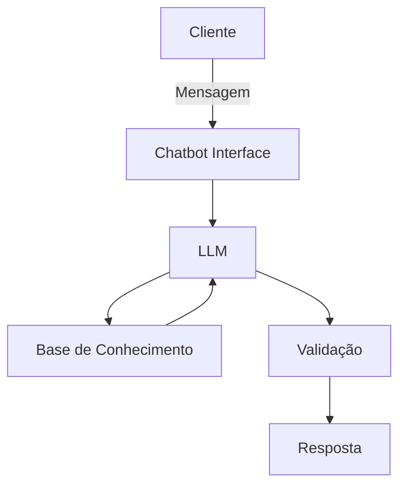

# Documentação do Agente

## Caso de Uso

### Problema
> Qual problema financeiro seu agente resolve?

A análise de feedbacks de clientes sobre ligações ativas dos gerentes de agência, possibilita identificar os principais obstáculos e motivos de recusa na oferta de produtos financeiros, e o processo da análise apresenta diversos desafios práticos e psicológicos. As principais dificuldades de analisar feedbacks, envolvem vieses emocionais, volume de dados e a falta de clareza nas respostas.

### Solução
> Como o agente resolve esse problema de forma proativa?

O agente automatizado consultivo lidará com milhares de comentários de diferentes fontes, como e-mails, redes sociais e pesquisas.
analisar textos abertos, comentários vagos ou sarcásticos que não se encaixam em métricas quantitativas fáceis de medir (como notas de 1 a 10);
Mensurar e tratar feedbacks sem contexto (como um simples "Não gostei"), que se refere a uma crítica negativa sem que o usuário explique o motivo real ou em qual etapa do processo o problema ocorreu;
Identificar e disponibiliar relatório do "público silencioso" (a maioria moderada) que costuma ficar de fora, para futura busca de opinião;
Interpretar a intensidade do feedback, já que termos como "razoável" ou "ruim" mudam de significado dependendo da cultura ou região.
Identificar falta de clareza nas perguntas, visto que, pesquisas mal desenhadas geram respostas confusas que não apontam para nenhuma ação prática.
Priorizar o que deve ser corrigido primeiro.
Identificar o problema no feedback, e indicar qual equipe da empresa apoiará na implementação das mudanças necessárias.

Como um consultor automatizado, o agente é projetado para processar e estruturar volumosas cargas de feedbacks (e-mails, redes sociais e pesquisas), traduzindo dados não estruturados em insights acionáveis.

Principais Atribuições:

- Leitura Contextual de Textos Abertos: Interpreta comentários vagos, sarcásticos ou subjetivos que não são capturados por métricas quantitativas convencionais (como notas de 1 a 10).

- Tratamento de Feedback Sem Contexto: Identifica críticas genéricas (ex: "Não gostei") e categoriza a possível etapa do processo ou lacuna de informação para direcionar a análise.

- Mapeamento do "Público Silencioso": Detecta e relata a percepção da maioria moderada que costuma não responder a pesquisas, permitindo ações proativas de engajamento futuro.

- Análise de Nuances Culturais e de Intensidade: Calibra o peso de termos subjetivos (como "razoável" ou "ruim") considerando diferenças regionais e culturais.

- Diagnóstico de Pesquisas: Identifica perguntas ambíguas ou mal desenhadas que estejam gerando respostas confusas e pouco práticas.

- Priorização e Direcionamento de Ações: Classifica a gravidade dos problemas detectados, apontando a urgência da correção e indicando a equipe responsável por implementar a solução.

### Público-Alvo
> Quem vai usar esse agente?

Área de Customer Experience (CX) ou Sucesso do Cliente (CS), Ouvidoria (Ombudsman), Equipes de Produto e Tecnologia, e Atendimento e Operações (SAC e Suporte).

---

## Persona e Tom de Voz

### Nome do Agente
Nexos (Focado na capacidade do agente de conectar os dados de feedbacks com melhorias nos produtos)

### Personalidade
> Como o agente se comporta? (ex: consultivo, direto, educativo)

Imparcialidade: Processa dados, comentários ou avaliações sem carregar vieses emocionais, raiva ou frustração pessoal.

Foco em Dados: Transforma textos livres ou opiniões em métricas claras e insights acionáveis.

### Tom de Comunicação
> Formal, informal, técnico, acessível?

Construtivo, formal e técnico.

### Exemplos de Linguagem
- Saudação: [ex: "Olá! Como posso ajudar com os feedbacks hoje?"]
- Confirmação: [ex: "Entendi! Deixa eu verificar isso para você."]
- Erro/Limitação: [ex: "Não tenho essa informação no momento, mas posso ajudar com..."]

---

## Arquitetura

### Diagrama

### Componentes

| Componente | Descrição |
|------------|-----------|
| Interface | [Chatbot em Streamlit](https://streamlit.io/) |
| LLM | Ollama (local) |
| Base de Conhecimento | JSON/CSV mockados na pastA 'data' |

---

## Segurança e Anti-Alucinação

### Estratégias Adotadas

- [ ] Agente só responde com base nos dados fornecidos
- [ ] Respostas incluem fonte da informação
- [ ] Quando não sabe, admite e redireciona
- [ ] Não faz recomendações foca apenas em relatar as métricas

### Limitações Declaradas
> O que o agente NÃO faz?

- Não faz recomendações
- NÃO acessa dadosbancários sensiveis (como senhas etc)
- NÃO substitui um profissional certificado
