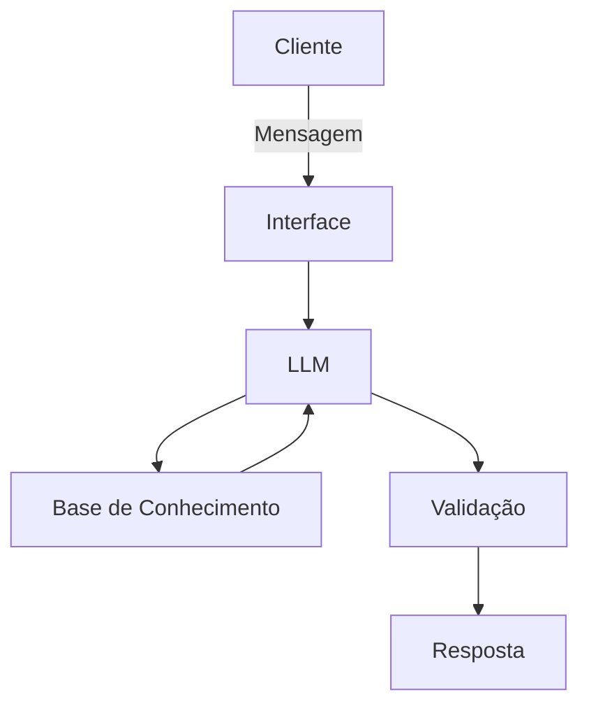

# Documentação do Agente

## Caso de Uso

### Problema
> Qual problema financeiro seu agente resolve?

A análise de feedbacks de clientes sobre ligações ativas dos gerentes de agência, possibilita identificar os principais obstáculos e motivos de recusa na oferta de produtos financeiros, e o processo da análise apresenta diversos desafios práticos e psicológicos. As principais dificuldades de analisar feedbacks, envolvem vieses emocionais, volume de dados e a falta de clareza nas respostas.

### Solução
> Como o agente resolve esse problema de forma proativa?

Será um agente automatizado consultivo, que irá: lidar com milhares de comentários de fontes diferentes (e-mails, redes sociais e pesquisas);
analisar textos abertos, comentários vagos ou sarcásticos que não se encaixam em métricas quantitativas fáceis de medir (como notas de 1 a 10);
Mensurar e tratar feedbacks sem contexto (como um simples "Não gostei"), que se refere a uma crítica negativa sem que o usuário explique o motivo real ou em qual etapa do processo o problema ocorreu;
Identificar e disponibiliar relatório do "público silencioso" (a maioria moderada) que costuma ficar de fora, para futura busca de opinião;
Interpretar a intensidade do feedback, já que termos como "razoável" ou "ruim" mudam de significado dependendo da cultura ou região.
Identificar falta de clareza nas perguntas, visto que, pesquisas mal desenhadas geram respostas confusas que não apontam para nenhuma ação prática.
Priorizar o que deve ser corrigido primeiro.
Identificar o problema no feedback, e indicar qual equipe da empresa apoiará na implementação das mudanças necessárias.

### Público-Alvo
> Quem vai usar esse agente?

Área de Customer Experience (CX) ou Sucesso do Cliente (CS), Ouvidoria (Ombudsman), Equipes de Produto e Tecnologia, e Atendimento e Operações (SAC e Suporte).

---

## Persona e Tom de Voz

### Nome do Agente
Nexos (Focado na capacidade do agente de conectar os dados de feedbacks com melhorias nos produtos)

### Personalidade
> Como o agente se comporta? (ex: consultivo, direto, educativo)

Impacialidade
Foco em dados

### Tom de Comunicação
> Formal, informal, técnico, acessível?

Tom Construtivo

### Exemplos de Linguagem
- Saudação: [ex: "Olá! Como posso ajudar com suas finanças hoje?"]
- Confirmação: [ex: "Entendi! Deixa eu verificar isso para você."]
- Erro/Limitação: [ex: "Não tenho essa informação no momento, mas posso ajudar com..."]

---

## Arquitetura

### Diagrama

### Componentes

| Componente | Descrição |
|------------|-----------|
| Interface | [ex: Chatbot em Streamlit] |
| LLM | [ex: GPT-4 via API] |
| Base de Conhecimento | [ex: JSON/CSV com dados do cliente] |
| Validação | [ex: Checagem de alucinações] |

---

## Segurança e Anti-Alucinação

### Estratégias Adotadas

- [ ] [ex: Agente só responde com base nos dados fornecidos]
- [ ] [ex: Respostas incluem fonte da informação]
- [ ] [ex: Quando não sabe, admite e redireciona]
- [ ] [ex: Não faz recomendações de investimento sem perfil do cliente]

### Limitações Declaradas
> O que o agente NÃO faz?

[Liste aqui as limitações explícitas do agente]
